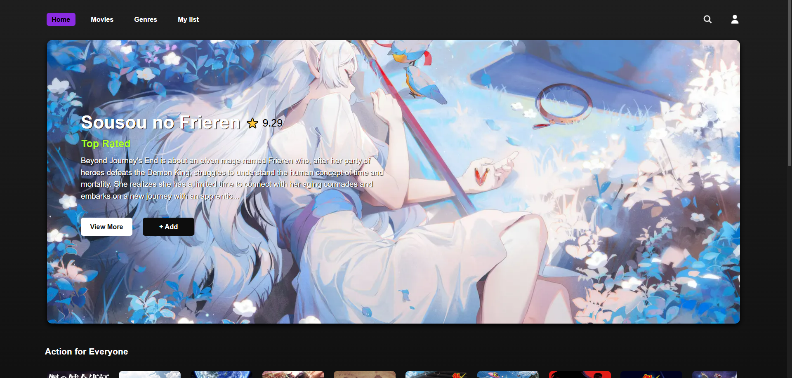
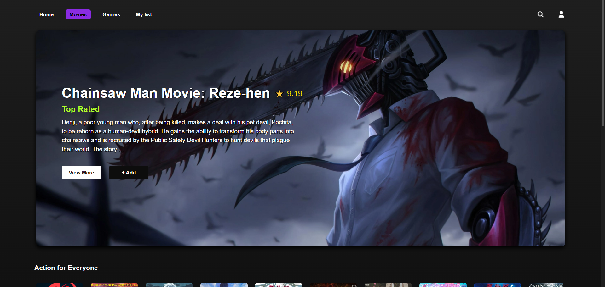
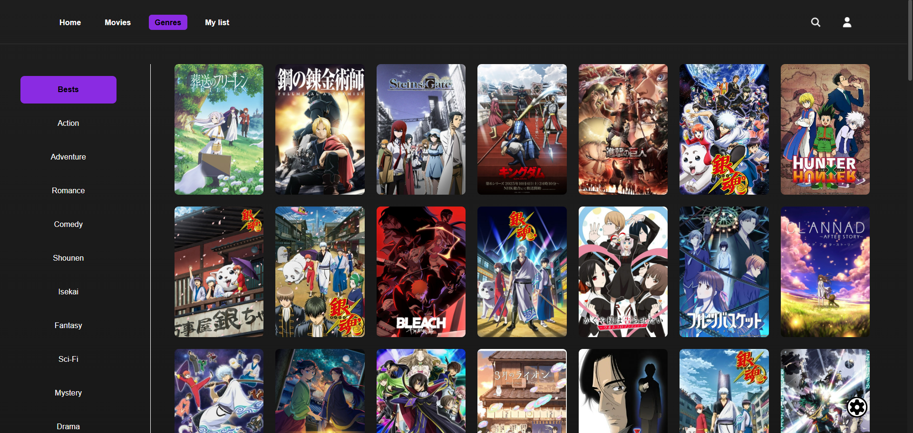
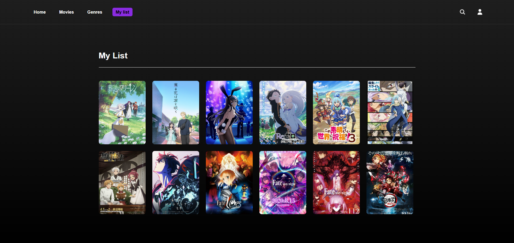
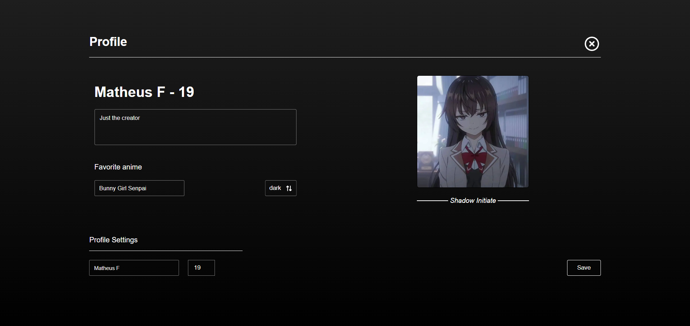

# 📺 AnimeList

A Netflix-inspired anime streaming interface built with **Next.js**, featuring anime search, genre filtering, a favorites system, personal lists, and a customizable user profile.

---

## 📌 About the Project

**AnimeList** is a web application that recreates the Netflix user experience, but fully focused on anime.  
Users can:

- 🔍 Search for anime in real time  
- 🎭 Filter by genres and personal preferences  
- ⭐ Add anime to their favorites  
- 📚 Manage a personalized anime library (“My List”)  
- 👤 Edit profile information  
- 🧭 Navigate between **Home, Movies, Genres, My List, Profile and Search**
- 🌓 Switch between **Light Mode and Dark Mode**

The goal is to provide a clean, modern and immersive anime browsing experience. All preferences are saved in **Local Storage**, some require you to save manually, others don't.

---

## 🖼️ Project Banner


<p align="center">
  
</p>

---

## 📸 Screenshots


### 🔹 Movies Page
<p align="center">
  
</p>

### 🔹 Genres Page
<p align="center">
  
</p>

### 🔹 My List
<p align="center">
  
</p>

### 🔹 Profile Page
<p align="center">
  
</p>


---

## 🚀 Requirements

To run this project locally, you will need:

- **Node.js v18 or higher**
- **Next.js 16**
- NPM or Yarn package manager

---

## 📦 Installation

Clone the repository:

```bash
git clone https://github.com/YOUR-USERNAME/AnimeList.git


This project was created with Next.js 16 using create-next-app and expanded into a full anime browsing platform.


## Getting Started

First, run the development server:

```bash
npm run dev
# or
yarn dev
# or
pnpm dev
# or
bun dev
```

Open [http://localhost:3000](http://localhost:3000) with your browser to see the result.

You can start editing the page by modifying `app/(pages)/(home)/page.tsx`. The page auto-updates as you edit the file.

This project uses [`next/font`](https://nextjs.org/docs/app/building-your-application/optimizing/fonts) to automatically optimize and load [Geist](https://vercel.com/font), a new font family for Vercel.


## Deploy on Vercel

The easiest way to deploy your Next.js app is to use the [Vercel Platform](https://vercel.com/new?utm_medium=default-template&filter=next.js&utm_source=create-next-app&utm_campaign=create-next-app-readme) from the creators of Next.js.

Check out the [Next.js deployment documentation](https://nextjs.org/docs/app/building-your-application/deploying) for more details.
